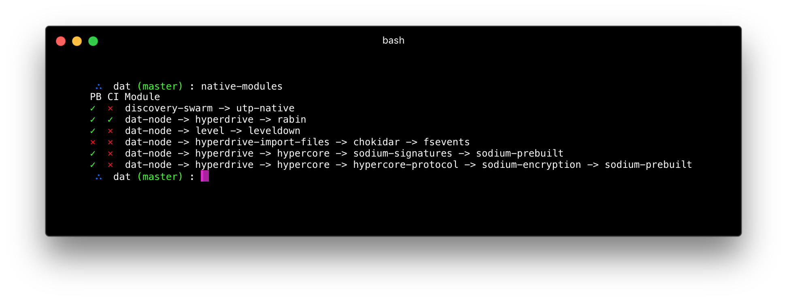

# native-modules

Report on the native node modules used by your application or module.

Checks for presence of [prebuild](https://npmjs.org/package/prebuild) and [prebuild-ci](https://npmjs.org/package/prebuild-ci).



## Usage

```bash
 $ native-modules 
```

## Installation

```bash
$ npm install -g native-modules
```

## License

MIT
